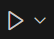
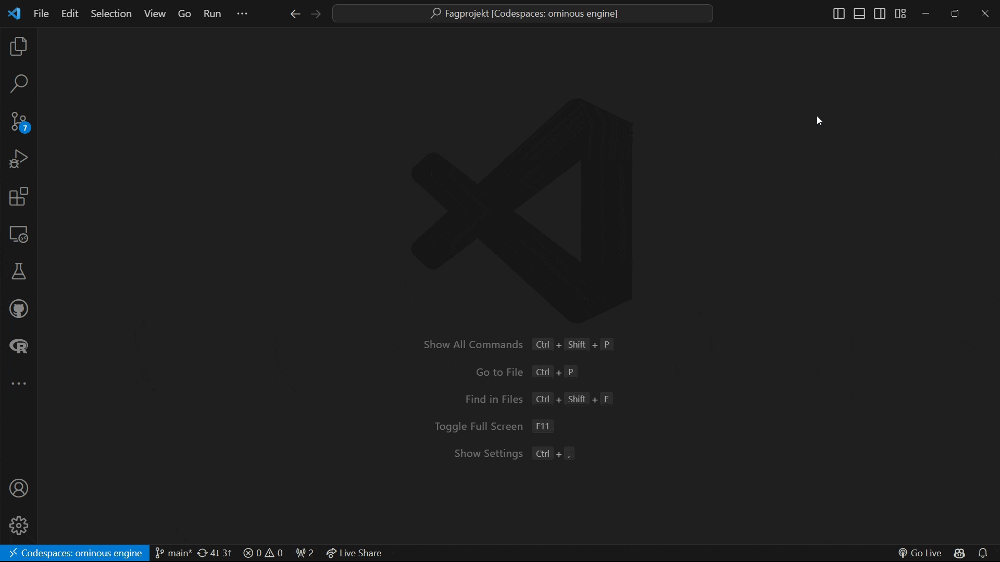

# Fagprojekt

## Environment
[Anaconda](https://docs.anaconda.com/index.html) is used to manage the Python environment. For conda cheatsheet, please visit [this link](miscellaneous/conda-cheatsheet.pdf).

[Pip](https://pip.pypa.io/en/stable/) is used to install the required packages.

## How to get started? (Prerequisites: [Anaconda](https://www.anaconda.com/download) installed)

> [!note]
> If you do not like [Anaconda](https://www.anaconda.com/download) installed locally in the computer, **GitHub Codespaces** is an alternative.

1. create a new conda environment: 
```bash
conda create -n ml python=3.7.6
```
2. When conda asks you to proceed, type `y` or simply hit `Enter`:
```bash
proceed ([y]/n)?
```
3. Initialize the environment: 
```bash
conda init
```
4. Kill the current shell (by clicking on trash can icon) and open a new one.
5. activate the environment: 
```bash
conda activate ml
```
6. install the required packages: 
```bash
pip install --no-cache-dir -r requirements.txt
```
> [!note]
> Remember to run `conda activate ml` every time you open a new terminal window. 
> To deactivate the environment, run `conda deactivate`.

## Short introduction to git
> [!note]
> All quotes in this section are from [git-scm](https://git-scm.com/docs).
### `git pull`
> Incorporates changes from a remote repository into the current branch.

It means that it fetches up-to-date repository from GitHub and merge with your local repository.

It is a good practice to run `git pull` before you start working on the project.

### `git add [FILES]`
> This command updates the index using the current content found in the working tree, to prepare the content staged for the next commit.

In human language, it means that you are telling git to track the changes in the files you have specified.

To add all the files in the current directory, run:
```bash
git add .
```

### `git commit -m "MESSAGE"`
> Create a new commit containing the current contents of the index and the given log message describing the changes.

In human language, it means that you are telling git to save the changes you have made to the files you have specified from `git add [FILES]`.

For detailed commit message, you also can try:
```bash
git commit -m "MESSAGE" -m "DESCRIPTION"
```

### `git push`
> Updates remote refs using local refs, while sending objects necessary to complete the given refs.

You are telling git to upload the changes you have made (namely commits) to the remote repository.

## How to delete the conda environment?
To delete an environment that was created earlier, we use the commands
```bash
conda env remove --name ml
```

To verify that the environment was removed, in your terminal window, run:
```bash
conda info --envs
```

## Recommended VS Code extensions
[Python](https://marketplace.visualstudio.com/items?itemName=ms-python.python)

Remark: After installing the extension, you will see a "run python file button"  on the top right of VS code. By default it select the base python interpreter. To make the button work in our case, remember to select the Python interpreter.

Here is how to do it:
1. Press `Ctrl+Shift+P` to open the command palette.
2. Type `Python: Select Interpreter` and select the Python interpreter you have installed.
3. Now you can run the Python file by simply clicking the button


Have fun with the project!

Ivan